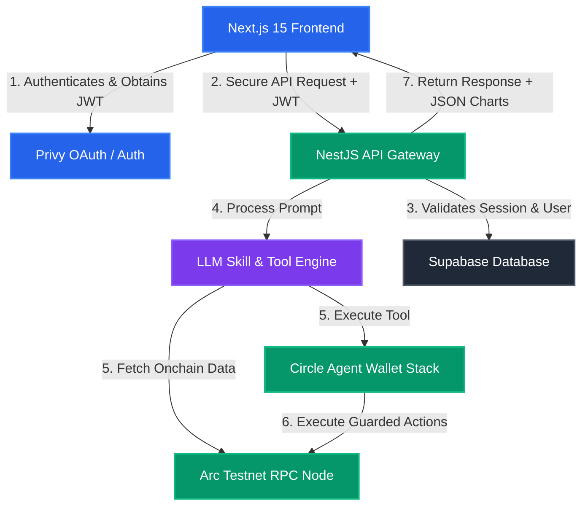
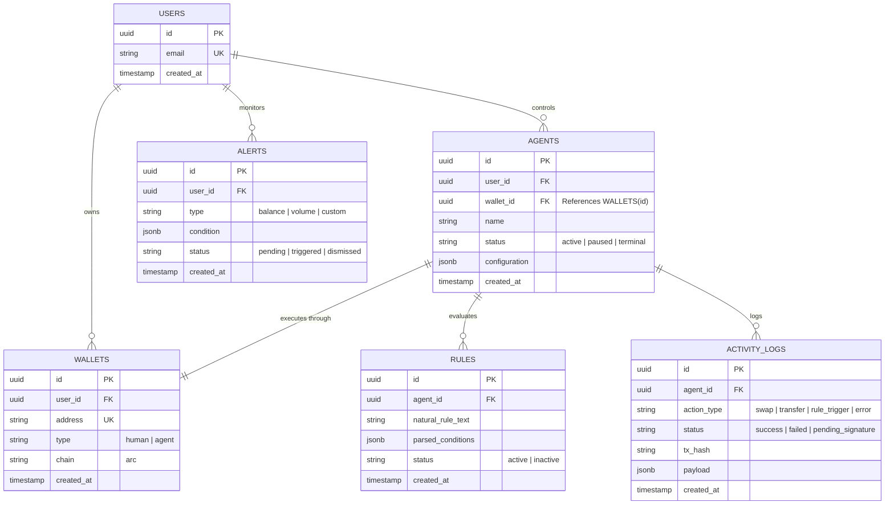

# ArcWallet AI - Backend Development Roadmap

Welcome to the backend engineering phase of **ArcWallet AI**! Now that the frontend foundation is established, the next stage is constructing a robust, high-performance, and secure **NestJS backend**. This backend acts as the orchestrator between human intent (Privy embedded wallets), autonomous execution (Circle Agent Wallets), visual blockchain analytics (Arc Testnet RPC & Indexers), and LLM-driven intelligence.

Below is the complete architectural blueprint and chronological implementation roadmap to take ArcWallet AI from a fresh NestJS scaffold to a fully functional production-ready MVP.

---

## 🏗️ High-Level System Architecture

The NestJS backend will orchestrate interactions between the user, Privy authentication, the Claude 3.5 LLM engine, and the Circle Agent Wallet infrastructure on **Arc Testnet (Chain ID: 5042002)**.



---

## 🗄️ Database Schema Design (Supabase / PostgreSQL)

Before implementing services, we must define the database layer. This structure supports our **Dual-Wallet Architecture** and maps users to their persistent agents, active automation rules, and activity logs.

### Database Tables & Relationships



---

## 🗺️ Chronological Backend Roadmap

```
Phase 1: Foundation & Auth (Week 1)
├── Scaffold NestJS modules (Auth, Users, Wallets, LLM, Circle)
└── Integrate Privy JWT Validation Guard
Phase 2: Circle Agent Stack Integration (Week 2-3)
├── Setup Circle CLI bootstrap on server
└── Create Circle Wallet generator & Spending policy manager
Phase 3: Database & Rule Engine (Week 4)
├── Connect Prisma/Supabase & apply migrations
└── Build Automation Engine Scheduler for polling blockchain conditions
Phase 4: LLM Skill Engine (Week 5-6)
├── Register the 10 Core Skills in standard tool formats
└── Build Chat Orchestrator endpoint with Context Memory
Phase 5: Visual Analytics & Arc RPC (Week 7)
├── Integrate Arc Testnet RPC endpoints
└── Create data aggregators matching frontend Recharts specifications
Phase 6: Safety Guardrails & Privy Execution (Week 8)
├── Build Risk Guardian score checker
└── Setup "Prepare -> Sign -> Execute" flow for high-value txs
Phase 7: Optimization & Launch (Week 9-10)
├── Implement caching & rate limiters
└── Deploy to staging and perform automated web3 integration tests
```

---

### 🔑 Phase 1: Foundation & Authentication (Week 1)
Set up the codebase organization and secure the API layer using the user's Privy identity.

- [ ] **Scaffold NestJS Modules**: Structure the backend cleanly.
  - Create core modules: `AuthModule`, `UserModule`, `WalletModule`, `AgentModule`, `RuleModule`, `AnalyticsModule`, `LlmModule`, and `CircleModule`.
- [ ] **Privy JWT Authentication Guard**:
  - Implement a global `AuthGuard` that extracts Privy JWT tokens from authorization headers.
  - Fetch and verify the Privy public signature keys to validate user identity without hitting Privy endpoints on every request.
  - Attach the validated `userId` and `email` to the request context.
- [ ] **User Sync Pipeline**:
  - Create a `/auth/sync` endpoint that takes the Privy-authenticated user details and updates the database, provisioning a base user record if it doesn't already exist.

---

### ⚙️ Phase 2: Circle Agent Stack Integration (Week 2-3)
Initialize the execution engine using the **Circle Agent Stack** and the **Circle CLI** to spin up dedicated server-side agent wallets.

- [ ] **Verify Circle CLI Environment**:
  - Ensure `@circle-fin/cli` is securely installed and accessible in the hosting environment.
- [ ] **Agent Wallet Lifecycle Controller**:
  - Implement a backend worker that utilizes the Circle API or CLI to provision programmatic Smart Contract Wallets (SCA) for agents on **Arc Testnet**.
  - Store the generated agent wallet addresses securely, linking them to the parent user profile in the database.
- [ ] **Circle Spending Policy Manager**:
  - Integrate strict on-chain policies via the `circle` API: configure transaction limits, daily caps, and monthly allowances to ensure complete cryptographic isolation and capital safety.
  - Implement a recovery channel to easily top up the wallet balance when needed using the **fiat on-ramp** or **Gateway deposit** workflows.

---

### 🤖 Phase 3: Database & Rule Engine (Week 4)
Create the persistence layer and build the scheduler that evaluates conditional logic and triggers agent actions.

- [ ] **Database Connection (Prisma / TypeORM + Supabase)**:
  - Generate database schemas, write migrations, and establish a secure database connection.
- [ ] **Automation Engine Scheduler**:
  - Set up a background cron scheduler in NestJS (using `@nestjs/schedule` or `BullMQ`) to regularly check active automation rules.
  - Create standard evaluator triggers (e.g., checking if `balance < limit` or if `current_price > target_price` on-chain).
- [ ] **Audit Trail Log Writer**:
  - Build a logging utility that records every rule evaluation, database transaction, and blockchain action in the `ACTIVITY_LOGS` table.

---

### 🧠 Phase 4: LLM Skill Engine (Week 5-6)
Introduce the AI intelligence layer using Claude 3.5 Sonnet, implementing a tool-calling registry based on the **10 Core Skills**.

- [ ] **Core Skill Tool Registry**:
  - Implement the schemas, JSON input-output formats, and handlers for the 10 Core Skills specified in the registry (e.g. `get_wallet_details`, `get_analytics_data`, `create_rule`, `prepare_transaction`).
- [ ] **Context Memory & History Manager**:
  - Setup a session-based chat history store in PostgreSQL, supplying the last 15-20 messages to the LLM context to maintain continuous dialogue.
- [ ] **Dual-Output API Controller**:
  - Design the main `/agent/chat` controller. Every response must match the frontend requirement:
    ```json
    {
      "message": "Human-friendly explanation of the execution or findings.",
      "structuredData": {
        "charts": {},       // for volume, DEX, or portfolio trends
        "transactions": [], // for tables and sorting
        "actions": []       // to trigger Privy signature flows in frontend
      },
      "toolsUsed": ["get_portfolio_summary", "assess_transaction_risk"],
      "confidence": 0.98
    }
    ```

---

### 📊 Phase 5: Visual Analytics & Arc RPC (Week 7)
Integrate deep blockchain data indexing and Arc Testnet RPC nodes to feed the visual charts and dashboard views.

- [ ] **Arc Testnet RPC Provider**:
  - Connect a customized `viem` or `ethers` provider configured for the **Arc Testnet (Chain ID: 5042002)** using specialized Reth endpoints.
- [ ] **Visual Analytics Data Aggregator**:
  - Build analytical processors compiling volume trends (7d/30d/90d), DEX distributions, bridge usage breakdowns, and portfolio valuation histories.
  - Cache RPC read operations for 30-60 seconds to ensure sub-second dashboard loading speeds and prevent API rate-limiting.

---

### 🛡️ Phase 6: Safety Guardrails & Privy Execution (Week 8)
Build the visual validation and cryptographic verification boundaries that keep user capital secure.

- [ ] **Risk & Security Guardian Service**:
  - Develop a real-time risk evaluation service that runs before any transaction is executed.
  - Assess contract verification status, score execution paths (0-100), and block anomalies automatically.
- [ ] **Dual-Wallet Transaction Orchestration**:
  - Implement a `prepare_transaction` endpoint returning raw transaction payloads to the frontend.
  - For transaction values above **$50 USDC** or high-risk actions, prompt the Next.js frontend to request an explicit cryptographic signature from the user's Privy embedded wallet.
  - Develop an `execute_transaction` endpoint that accepts the client-signed transaction payload and broadcasts it to the **Arc Testnet** node securely.

---

### 🧪 Phase 7: Optimization & Launch Verification (Week 9-10)
Secure, optimize, test, and prepare the NestJS backend for full production deployment.

- [ ] **Security Auditing**:
  - Perform dependency vulnerability scanning and secure sensitive variables (API keys, DB URIs, and credentials).
  - Run the `firebase-security-rules-auditor` or equivalent check on Supabase schemas to guarantee bulletproof access controls.
- [ ] **Rate Limiting & Performance Tuning**:
  - Implement global rate limiting in NestJS (using `@nestjs/throttler`).
  - Optimize SQL queries using database indexes on search-heavy fields (`user_id`, `wallet_address`, and `agent_id`).
- [ ] **Integration & End-to-End Tests**:
  - Write automated tests checking the Privy signature validation, tool execution loops, database operations, and live transaction broadcasts on Arc Testnet.

---

## 🚀 Recommended Immediate Next Steps

To begin developing the backend cleanly and efficiently, execute these immediate actions:

1. **Step 1: Set Up Env Variables** - Create a `/backend/.env` file with placeholders for Privy keys, Supabase DB credentials, LLM API keys (OpenAI/Anthropic), and the Circle CLI profile values.
2. **Step 2: Initialize Privy Guard** - Code the custom validation guard inside `auth.guard.ts` to secure the first NestJS routes.
3. **Step 3: Define DB Schema** - Write the Prisma schema (`schema.prisma`) mapping out the exact tables outlined above and sync it with your Supabase database.
